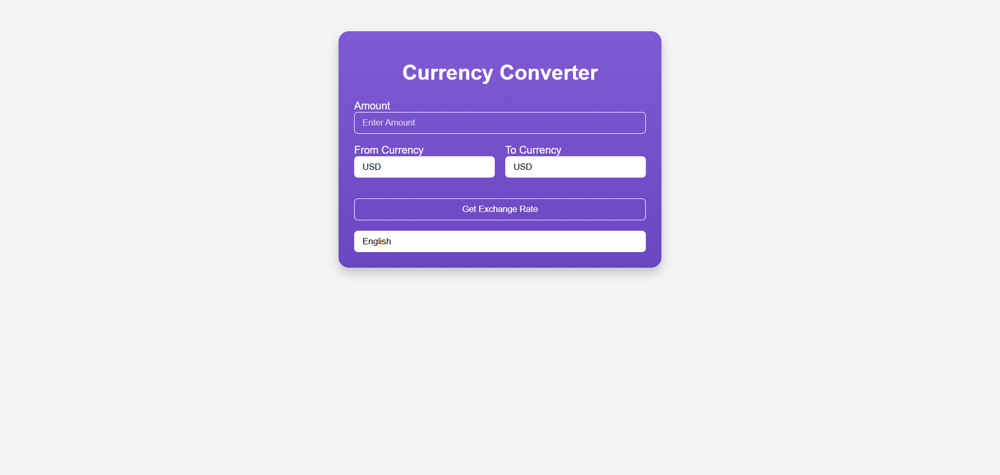

# Currency Converter 🌍💰

## Overview
The **Currency Converter** is a simple and elegant web application that allows users to convert currencies dynamically. Built with **Ruby on Rails** and **TailwindCSS**, it provides an intuitive interface and a seamless user experience.

## Features ✨
- 🏦 Convert between multiple currencies.
- 📊 Fetch real-time exchange rates.
- 🌍 Multi-language support (English, French, Spanish, German, Arabic).
- 🛠️ User-friendly UI with a responsive design.
- ❌ Error handling for incorrect inputs.
- 🎨 Styled with **TailwindCSS** for a modern look.

## Technologies Used 🚀
- **Ruby on Rails** (Backend)
- **TailwindCSS** (Frontend)
- **I18n (Internationalization)** for multi-language support
- **Exchange Rate API** (for fetching live conversion rates)

## Installation 🛠️
1. **Clone the repository**
   ```sh
   git clone https://github.com/muhammadshiraz/rails-currency-converter-multilingual.git
   cd rails-currency-converter-multilingual
   ```

2. **Install dependencies**
   ```sh
   bundle install
   ```

3. **Start the Rails server**
   ```sh
   rails s
   ```

4. **Open in browser**
   ```sh
   http://127.0.0.1:3000
   ```

## Usage 📌
1. Enter the amount you want to convert.
2. Select the source currency.
3. Select the target currency.
4. Click on **"Get Exchange Rate"**.
5. View the converted amount instantly!

## Multi-Language Support 🌍
- You can change the language using the dropdown menu.
- Supported languages:
  - 🇬🇧 English
  - 🇫🇷 French
  - 🇪🇸 Spanish
  - 🇩🇪 German
  - 🇸🇦 Arabic

## API Integration 🔗
This app uses an **Exchange Rate API** to fetch real-time conversion rates. You can configure the API in:
```ruby
app/services/exchange_rate_service.rb
```

## Screenshots 📸


## Contributing 🤝
Want to improve this project? Follow these steps:
1. Fork the repository 🍴
2. Create your feature branch (`git checkout -b feature-xyz`)
3. Commit your changes (`git commit -m 'Add some feature'`)
4. Push to the branch (`git push origin feature-xyz`)
5. Open a Pull Request ✅

## License 📜
This project is licensed under the **MIT License**.

## Contact 📬
Have any questions or suggestions? Feel free to reach out!
- **Email:** muhammadshiraz996@gmail.com
- **GitHub:** [muhammadshiraz](https://github.com/muhammadshiraz)

🚀 Happy Coding! 🎉